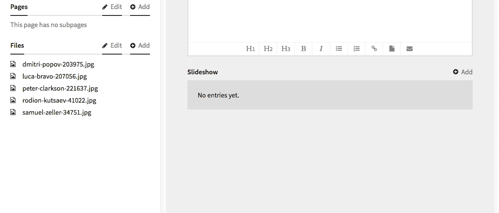

# Kirby Images v0.1

**This field is still in development and not quite ready yet.**

The `images` field can be used to edit groups of images very easily by drag-and-drop. Simply take an image from the sidebar and drop it on the field. You can also reorder images inside the field, not linked to the regular order.

## Installation

Put the `kirby-images` folder into your `site/plugins` folder and rename it to `images`.

## Example



````
slideshow:
  label:       Slideshow
  type:        images
````